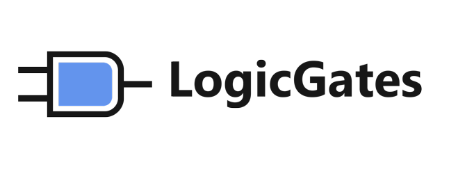

# LogicGates

 
## Приложение для создания логических схем на базе Godot Engine.
Форкнуто и модифицированно для сдачи выпускной квалификационной работы в ходе окончания учёбы в КФ ГУМРФ.
Приложение разработано специально для нужд КФ ГУМРФ.

## Изменения от оригинального репозитория:
- [x] Обновлённый UI в стиле файл-меню;
- [x] Переведённый на русский интерфейс;
- [x] Легенда выбранного узла (с названием и изображением по ГОСТу);
- [x] Некоторые скрипты были модифицированы для работы с новым UI;
